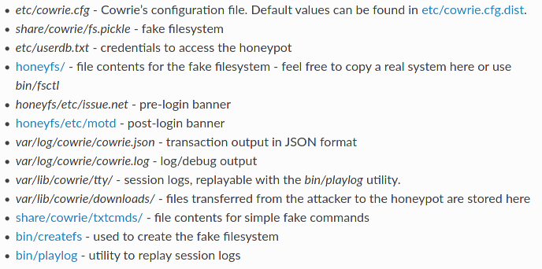
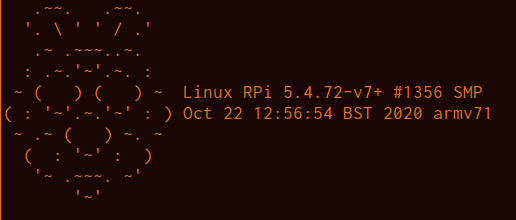
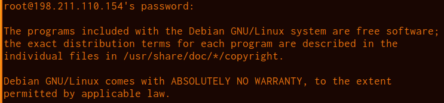
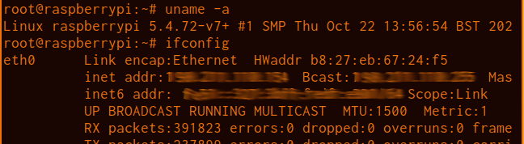
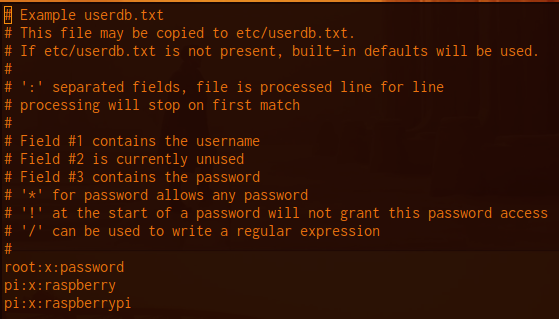
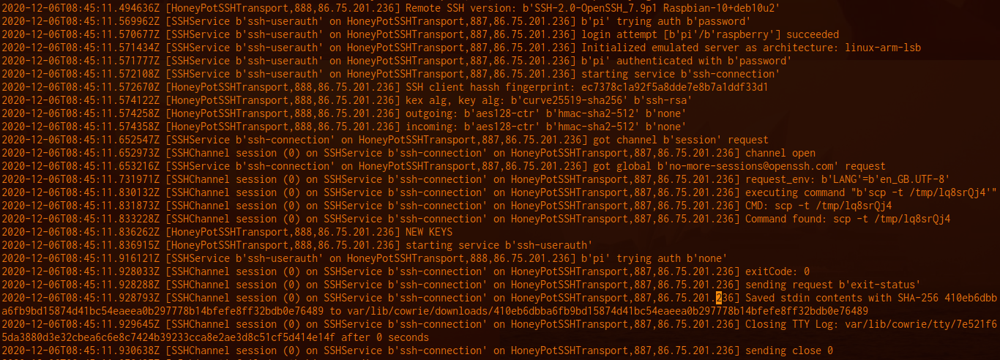
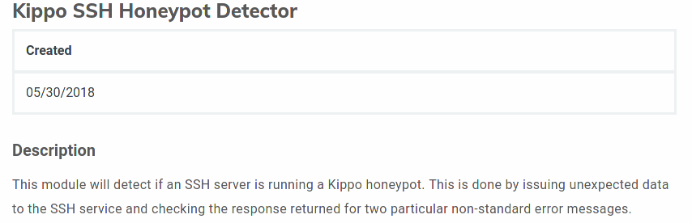
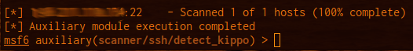
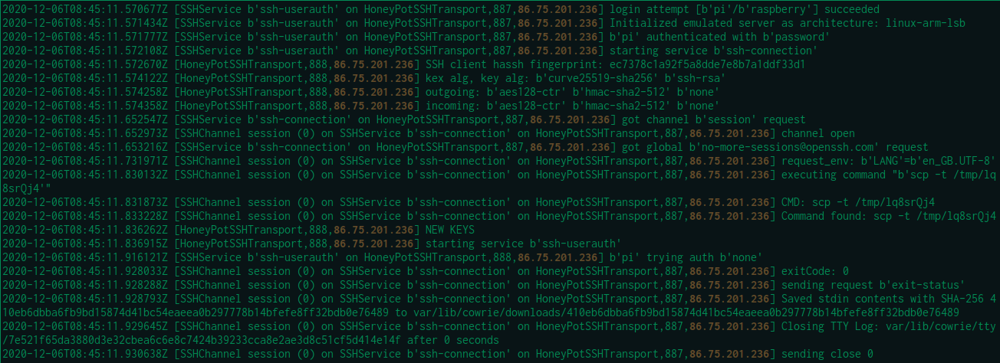
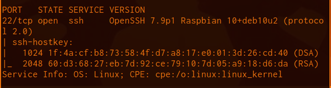

# What is Cowrie?
***[Cowrie](https://github.com/cowrie/cowrie) is a medium to high interaction SSH and Telnet honeypot designed to log brute force attacks and the shell interaction performed by the attacker. In medium interaction mode (shell) it emulates a UNIX system in Python, in high interaction mode (proxy) it functions as an SSH and telnet proxy to observe attacker behavior to another system.***

Cowrie is a fork of the popular honeypot Kippo (2009). Seeing the lack of certain logging and other features, a security researcher named Michael Oosterhof decided to make changes. He improved various facets and brought new features such as the proxy support. Following suit with Kippo, it was also developed using Python and Python Twist.

It works by serving attackers their own virtual filesystem once they have gotten access via bruteforcing. They have the ability to move around the filesystem as well as use a variety of commands that show realistic output. Any files they download can't be executed but are saved for your future analysis. Their entire TTY usage is logged and can be replayed as well.

# Requirements & Deployment

---

Software required:

* Python 3.6+
* Python-virtualenv

Other Python dependencies (via pip) are in the requirements.txt included with repo.

**There is also a [docker](https://hub.docker.com/r/cowrie/cowrie) version available!**

---

For the short test, I deployed it in a Ubuntu 20.04 LTS droplet with 1 vCPU, 1GB RAM, and a 50GB SSD. This is perfectly capable of being deployed on AWS EC2 free-tier.

The instructions are easily followed in the [official documentation](https://cowrie.readthedocs.io/en/latest/index.html). They can be summarized by creating a `cowrie` user without sudo privileges, grabbing the code from GitHub, satisfying python requirements, starting the virtual environment and subsequently creating some rules in the firewall for SSH & Telnet usage.

Since this is an SSH honeypot, we need to utilize port 22 (23 if using Telnet) but we still need our own access to the real SSH port for administration purposes. You'll need to move your personal SSH access up to a higher port. This can be configured via `/etc/ssh/sshd_config`. It's also not a bad idea to utilize key-based authentication and create another user (with sudo privileges), so you can disable root login! Cowrie by default listens for SSH on port 2222 (Telnet on 2223) due to <1024 port privileges. This doesn't do much good for mimicking the typical SSH configuration. Iptables forwarding rules or Authbind can be used to make port 22, accessible to attackers (See Step #7 of [install](https://cowrie.readthedocs.io/en/latest/INSTALL.html)).

# Configuration

Cowrie includes a variety of config files that help to simulate the feel of a real system. You're able to edit various files like the hostname to the output of `uname -a` or even `/proc/cpuinfo`. It even includes a `createfs` binary that allows you to copy the structure of a different filesystem. This is particularly useful if you wanted to simulate an embedded linux system instead of the default Debian 5.0 installation that Cowrie uses.

Refer to this page of the [documentation](https://cowrie.readthedocs.io/en/latest/README.html#files-of-interest) to see further config files.

For my test, I chose to simulate a Raspberry Pi 3B+ that was erroneously made accessible to the internet with default credentials. This involved changing a number of files, such as the hostname, architecture (ARMv7), SSH version and the output of many commands attackers would run once they had a shell.

Cowrie includes the ability to edit the pre & post-login banners.

Output of motd.

Example output showing kernel info as well as network interfaces. Note the OUI of the HWaddr.

Example output that an attacker would see if they were to `cat` `/proc/cpuinfo`.

**It's important to note that are a number of configurable outputs and files that will help to make the system appear more real. It's also possible to add your own commands and subsequent outputs as well as various files you may want to scatter across the filesystem. This guide provides some extra info on the customization. [https://cryptax.medium.com/customizing-your-cowrie-honeypot-8542c888ca49](https://cryptax.medium.com/customizing-your-cowrie-honeypot-8542c888ca49).**

## Configuring credentials
The `userdb.txt` file configures the username-password combinations for the server. This file does support [wildcards](https://tldp.org/LDP/GNU-Linux-Tools-Summary/html/x11655.htm). For example the (*) wildcard can be used to give the attacker access, no matter what password he inputs. There is also the ability to use the built-in defaults and have an attacker gain access after a random number of attempts. I chose to use some RPi defaults and a weak root password, for the test.

Copy the `userdb.example` to `userdb.txt` before editing.

# Analysis & Reporting
There is a variety of data gathered from the honeypot. The plaintext log of all ssh attempts and subsequent shell interaction is located in `cowrie/var/log/cowrie/cowrie.log`. There is also an accompanying JSON format log. For full TTY playback of shell interaction, these can be found in `cowrie/var/lib/cowrie/tty` and run using the `playlog` binary. All files that were downloaded by the attacker (whether via `wget`, `curl`, etc.) are located in `cowrie/var/lib/cowrie/downloads`. The filenames will be a SHA-256 hash of the associated unique event or file downloaded, respectively.

Following this initial test, I intend to setup an Elastic stack to handle the ingestion and display of the log files. There are guides in the official documentation for processing Cowrie output into various software:

* [ELK Stack](https://cowrie.readthedocs.io/en/latest/elk/README.html)
* [Graylog](https://cowrie.readthedocs.io/en/latest/graylog/README.html)
* [Kippo-graph](https://cowrie.readthedocs.io/en/latest/kippo-graph/README.html)
* [Azure Sentinel](https://cowrie.readthedocs.io/en/latest/sentinel/README.html)
* [Splunk](https://cowrie.readthedocs.io/en/latest/splunk/README.html)

Example `cowrie.log`, showing a successful login with credentials pi:raspberry and then subsequent file download via `scp`. The file was saved on our system but the script was prevented from executing.

**It's worth pointing out that Cowrie can work directly with the VirusTotal API. This can be configured within the `cowrie.cfg` file.**

# Fingerprinting
A honeypot is most effective when the attacker doesn't suspect that it's targeting or using a simulated system. With Cowrie being Open Source, all of it's code is able to be audited and thus certain characteristics and configurations could be easily fingerprinted, when it's out in the wild. This is why it's often worth while to change the defaults for any given honeypot.

I tested 2 basic methods against my server running Cowrie. The first was an Metasploit scanner designed for the Kippo honeypot, which Cowrie was based off of. It was unable to detect my honeypot when run against port 22. The other test was an nmap default script and service/version detection scan.

[https://www.rapid7.com/db/modules/auxiliary/scanner/ssh/detect_kippo/](https://www.rapid7.com/db/modules/auxiliary/scanner/ssh/detect_kippo/)

The scanner failed to return a successful detection.

# Captured shell script sample
Captured within [Cowrie SSH honeypot](https://github.com/cowrie/cowrie). 12/06/2020 @ 08:45:11 UTC

*Cowrie.log*

----
Zip archive password: `infected`
----

**SHA256 410eb6dbba6fb9bd15874d41bc54eaeea0b297778b14bfefe8ff32bdb0e76489**

**MD5 	a167b2dba9768f426a9331951555c339**

The script appears to be fairly similar to what was described in a Sans ISC Diary post, from 2018. [https://isc.sans.edu/diary/Malicious+Network+Traffic+From+binbash/23591](https://isc.sans.edu/diary/Malicious+Network+Traffic+From+binbash/23591)

#

*VirusTotal detections.*

Output of the `nmap -sC -sV` scan. Note the OpenSSH version showing as Raspbian. You can edit the version within `cowrie.cfg`.
